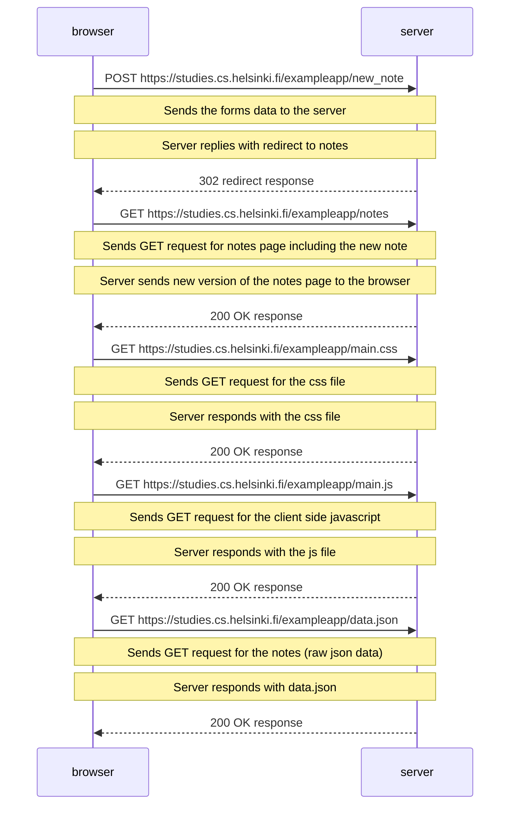

```mermaid
sequenceDiagram
    participant browser
    participant server

    browser->>server: POST https://studies.cs.helsinki.fi/exampleapp/new_note
    note over browser,server: Sends the forms data to the server
    note over server, browser: Server replies with redirect to notes
    server-->>browser: 302 redirect response 

    browser->>server: GET https://studies.cs.helsinki.fi/exampleapp/notes
    note over browser,server: Sends GET request for notes page including the new note
    note over server, browser: Server sends new version of the notes page to the browser
    server-->>browser: 200 OK response 
    
    browser->>server: GET https://studies.cs.helsinki.fi/exampleapp/main.css
    note over browser,server: Sends GET request for the css file
    note over server, browser: Server responds with the css file
    server-->>browser: 200 OK response 

    browser->>server: GET https://studies.cs.helsinki.fi/exampleapp/main.js
    note over browser,server: Sends GET request for the client side javascript
    note over server, browser: Server responds with the js file
    server-->>browser: 200 OK response 

    browser->>server: GET https://studies.cs.helsinki.fi/exampleapp/data.json
    note over browser,server: Sends GET request for the notes (raw json data)
    note over server, browser: Server responds with data.json
    server-->>browser: 200 OK response
```