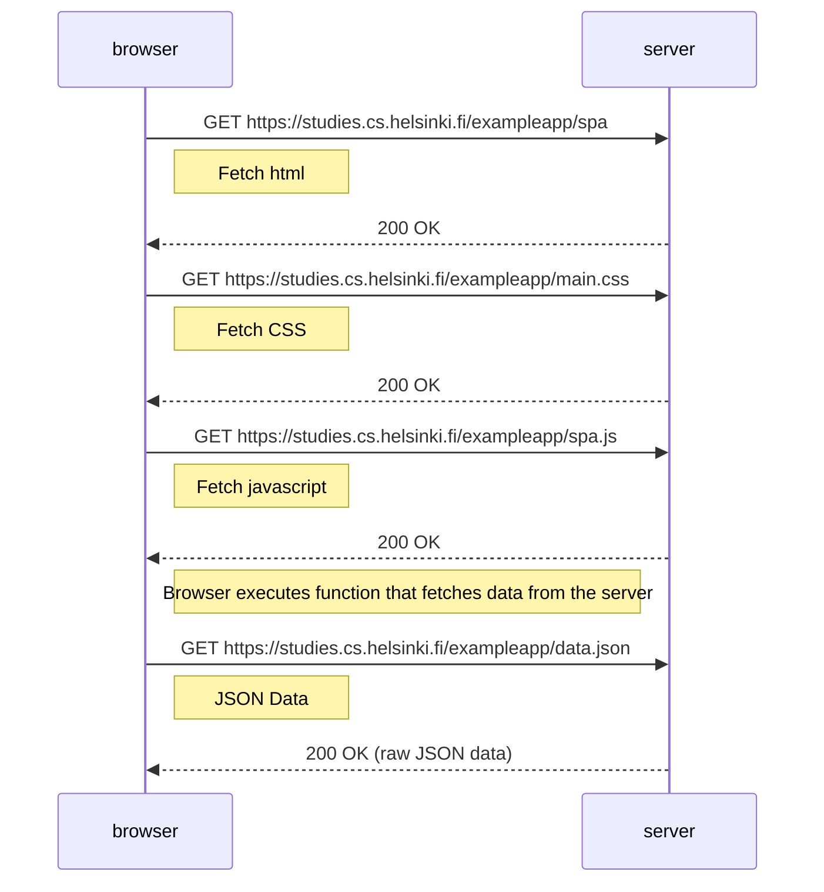

```mermaid
sequenceDiagram
    participant browser
    participant server

    browser->>server: GET https://studies.cs.helsinki.fi/exampleapp/spa
    Note right of browser: Fetch html
    server-->>browser: 200 OK 

    browser->>server: GET https://studies.cs.helsinki.fi/exampleapp/main.css
    Note right of browser: Fetch CSS
    server-->>browser: 200 OK 

    browser->>server: GET https://studies.cs.helsinki.fi/exampleapp/spa.js
    Note right of browser: Fetch javascript
    server-->>browser: 200 OK 
    Note right of browser: Browser executes function that fetches data from the server
    browser->>server: GET https://studies.cs.helsinki.fi/exampleapp/data.json
    Note right of browser: JSON Data
    server-->>browser: 200 OK (raw JSON data)

```